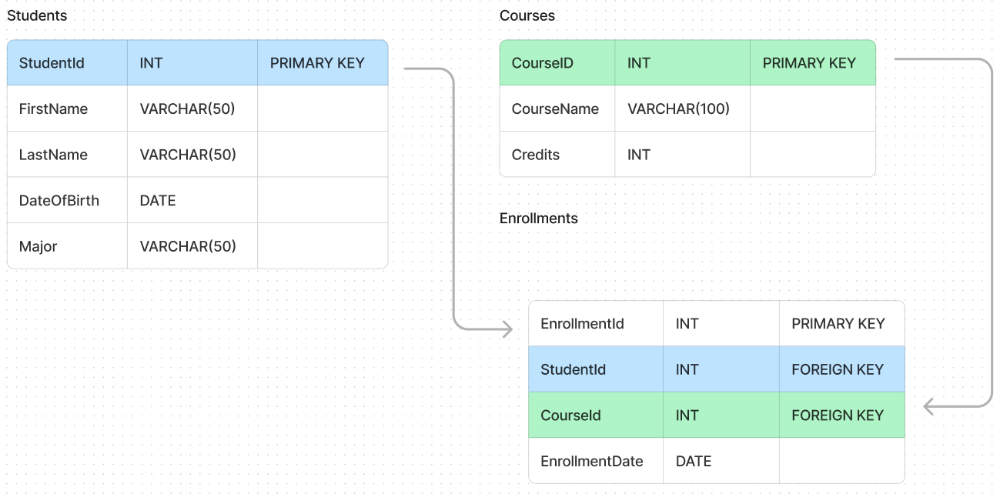

# SQL

### SQL SCHEMA

## TYPES OF QUERIES IN SQL

-   DDL
    -   [CREATE](./DDL/DDL.sql)
    -   [ALTER](./DDL/DDL.sql)
    -   [TRUNCATE](./DDL/DDL.sql)
    -   [DROP](./DDL/DDL.sql)
    -   [RENAME](./DDL/DDL.sql)
-   DML
    -   [INSERT](./sample_data.sql)
    -   [UPDATE](./DML/update.sql)
    -   [DELETE](./DML/delete.sql)
-   DCL
    -   GRANT
    -   REVOKE
-   TCL
    -   COMMIT
    -   ROLLBACK
    -   SAVEPOINT
-   DQL
    -   [SELECT](./DQL/select.sql)

## Others

-   [Aggregate function](./DQL/aggregate_function.sql)
-   [Regular expression](./DQL/regex.sql)
-   Joins
    -   [Join](./DQL/joins/join.sql)
